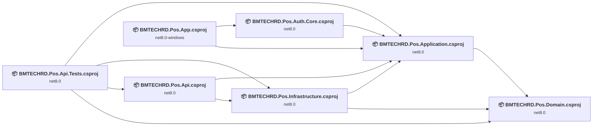
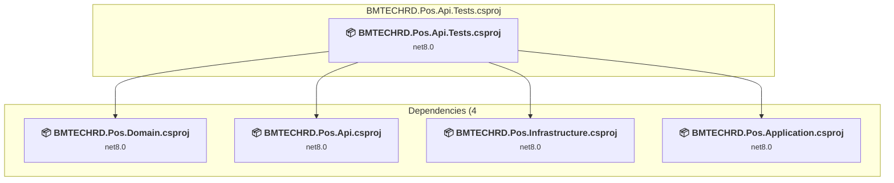
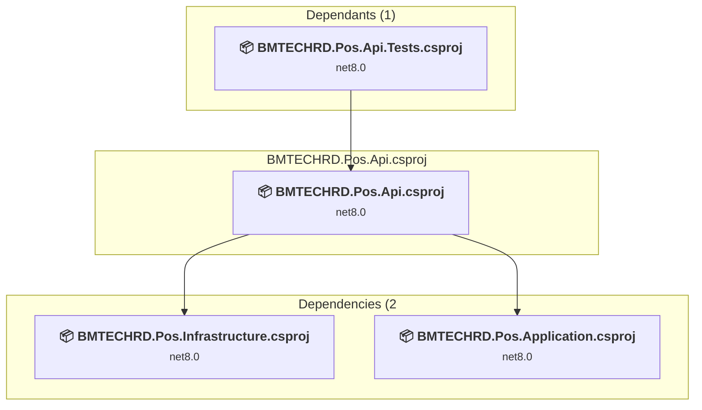
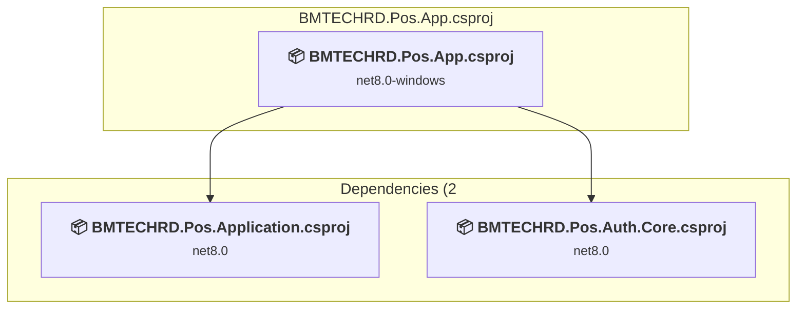
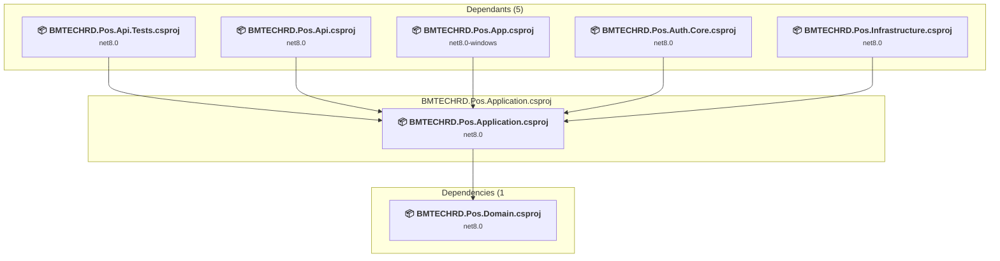
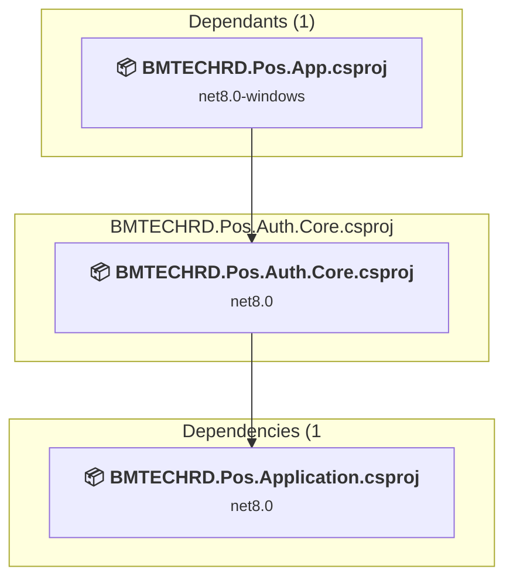
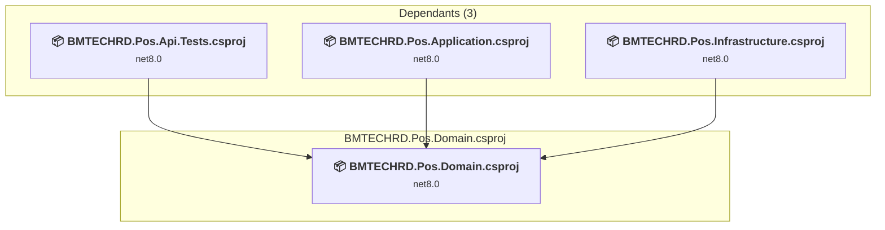
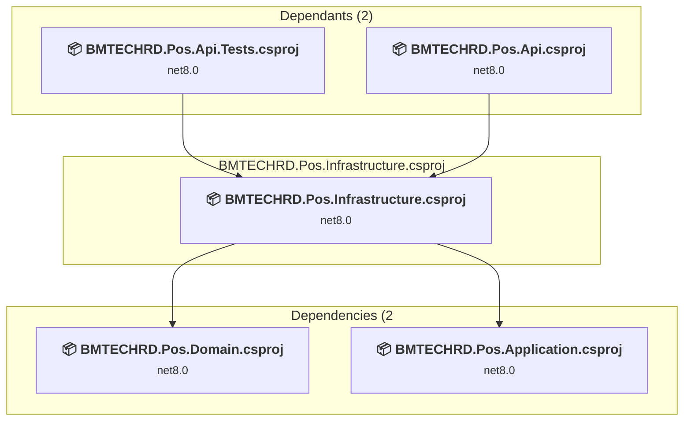

# Projects and dependencies analysis

This document provides a comprehensive overview of the projects and their dependencies in the context of upgrading to .NETCoreApp,Version=v10.0.

## Table of Contents

- [Executive Summary](#executive-Summary)
  - [Highlevel Metrics](#highlevel-metrics)
  - [Projects Compatibility](#projects-compatibility)
  - [Package Compatibility](#package-compatibility)
  - [API Compatibility](#api-compatibility)
- [Aggregate NuGet packages details](#aggregate-nuget-packages-details)
- [Top API Migration Challenges](#top-api-migration-challenges)
  - [Technologies and Features](#technologies-and-features)
  - [Most Frequent API Issues](#most-frequent-api-issues)
- [Projects Relationship Graph](#projects-relationship-graph)
- [Project Details](#project-details)

  - [BMTECHRD.Pos.Api.Tests\BMTECHRD.Pos.Api.Tests.csproj](#bmtechrdposapitestsbmtechrdposapitestscsproj)
  - [BMTECHRD.Pos.Api\BMTECHRD.Pos.Api.csproj](#bmtechrdposapibmtechrdposapicsproj)
  - [BMTECHRD.Pos.App\BMTECHRD.Pos.App.csproj](#bmtechrdposappbmtechrdposappcsproj)
  - [BMTECHRD.Pos.Application\BMTECHRD.Pos.Application.csproj](#bmtechrdposapplicationbmtechrdposapplicationcsproj)
  - [BMTECHRD.Pos.Auth.Core\BMTECHRD.Pos.Auth.Core.csproj](#bmtechrdposauthcorebmtechrdposauthcorecsproj)
  - [BMTECHRD.Pos.Domain\BMTECHRD.Pos.Domain.csproj](#bmtechrdposdomainbmtechrdposdomaincsproj)
  - [BMTECHRD.Pos.Infrastructure\BMTECHRD.Pos.Infrastructure.csproj](#bmtechrdposinfrastructurebmtechrdposinfrastructurecsproj)

## Executive Summary

### Highlevel Metrics

| Metric | Count | Status |
| :--- | :---: | :--- |
| Total Projects | 7 | All require upgrade |
| Total NuGet Packages | 26 | 15 need upgrade |
| Total Code Files | 260 |  |
| Total Code Files with Incidents | 64 |  |
| Total Lines of Code | 14657 |  |
| Total Number of Issues | 1155 |  |
| Estimated LOC to modify | 1131+ | at least 7.7% of codebase |

### Projects Compatibility

| Project | Target Framework | Difficulty | Package Issues | API Issues | Est. LOC Impact | Description |
| :--- | :---: | :---: | :---: | :---: | :---: | :--- |
| [BMTECHRD.Pos.Api.Tests\BMTECHRD.Pos.Api.Tests.csproj](#bmtechrdposapitestsbmtechrdposapitestscsproj) | net8.0 | 🟢 Low | 3 | 19 | 19+ | DotNetCoreApp, Sdk Style = True |
| [BMTECHRD.Pos.Api\BMTECHRD.Pos.Api.csproj](#bmtechrdposapibmtechrdposapicsproj) | net8.0 | 🟢 Low | 2 | 11 | 11+ | AspNetCore, Sdk Style = True |
| [BMTECHRD.Pos.App\BMTECHRD.Pos.App.csproj](#bmtechrdposappbmtechrdposappcsproj) | net8.0-windows | 🟡 Medium | 4 | 1082 | 1082+ | Wpf, Sdk Style = True |
| [BMTECHRD.Pos.Application\BMTECHRD.Pos.Application.csproj](#bmtechrdposapplicationbmtechrdposapplicationcsproj) | net8.0 | 🟢 Low | 0 | 0 |  | ClassLibrary, Sdk Style = True |
| [BMTECHRD.Pos.Auth.Core\BMTECHRD.Pos.Auth.Core.csproj](#bmtechrdposauthcorebmtechrdposauthcorecsproj) | net8.0 | 🟢 Low | 2 | 15 | 15+ | ClassLibrary, Sdk Style = True |
| [BMTECHRD.Pos.Domain\BMTECHRD.Pos.Domain.csproj](#bmtechrdposdomainbmtechrdposdomaincsproj) | net8.0 | 🟢 Low | 0 | 0 |  | ClassLibrary, Sdk Style = True |
| [BMTECHRD.Pos.Infrastructure\BMTECHRD.Pos.Infrastructure.csproj](#bmtechrdposinfrastructurebmtechrdposinfrastructurecsproj) | net8.0 | 🟢 Low | 6 | 4 | 4+ | ClassLibrary, Sdk Style = True |

### Package Compatibility

| Status | Count | Percentage |
| :--- | :---: | :---: |
| ✅ Compatible | 11 | 42.3% |
| ⚠️ Incompatible | 2 | 7.7% |
| 🔄 Upgrade Recommended | 13 | 50.0% |
| ***Total NuGet Packages*** | ***26*** | ***100%*** |

### API Compatibility

| Category | Count | Impact |
| :--- | :---: | :--- |
| 🔴 Binary Incompatible | 1018 | High - Require code changes |
| 🟡 Source Incompatible | 15 | Medium - Needs re-compilation and potential conflicting API error fixing |
| 🔵 Behavioral change | 98 | Low - Behavioral changes that may require testing at runtime |
| ✅ Compatible | 20989 |  |
| ***Total APIs Analyzed*** | ***22120*** |  |

## Aggregate NuGet packages details

| Package | Current Version | Suggested Version | Projects | Description |
| :--- | :---: | :---: | :--- | :--- |
| BCrypt.Net-Next | 4.0.2 |  | [BMTECHRD.Pos.Infrastructure.csproj](#bmtechrdposinfrastructurebmtechrdposinfrastructurecsproj) | ✅Compatible |
| Microsoft.AspNetCore.Authentication.JwtBearer | 8.0.8 | 10.0.3 | [BMTECHRD.Pos.Api.csproj](#bmtechrdposapibmtechrdposapicsproj) | Se recomienda actualizar el paquete NuGet |
| Microsoft.AspNetCore.Mvc.Testing | 8.0.8 | 10.0.3 | [BMTECHRD.Pos.Api.Tests.csproj](#bmtechrdposapitestsbmtechrdposapitestscsproj) | Se recomienda actualizar el paquete NuGet |
| Microsoft.AspNetCore.SignalR.Client | 8.0.8 | 10.0.3 | [BMTECHRD.Pos.App.csproj](#bmtechrdposappbmtechrdposappcsproj) | Se recomienda actualizar el paquete NuGet |
| Microsoft.EntityFrameworkCore | 8.0.8 | 10.0.3 | [BMTECHRD.Pos.Infrastructure.csproj](#bmtechrdposinfrastructurebmtechrdposinfrastructurecsproj) | Se recomienda actualizar el paquete NuGet |
| Microsoft.EntityFrameworkCore.Design | 8.0.8 | 10.0.3 | [BMTECHRD.Pos.Api.csproj](#bmtechrdposapibmtechrdposapicsproj) [BMTECHRD.Pos.Infrastructure.csproj](#bmtechrdposinfrastructurebmtechrdposinfrastructurecsproj) | Se recomienda actualizar el paquete NuGet |
| Microsoft.EntityFrameworkCore.InMemory | 8.0.8 | 10.0.3 | [BMTECHRD.Pos.Api.Tests.csproj](#bmtechrdposapitestsbmtechrdposapitestscsproj) | Se recomienda actualizar el paquete NuGet |
| Microsoft.EntityFrameworkCore.Relational | 8.0.8 | 10.0.3 | [BMTECHRD.Pos.Infrastructure.csproj](#bmtechrdposinfrastructurebmtechrdposinfrastructurecsproj) | Se recomienda actualizar el paquete NuGet |
| Microsoft.Extensions.Configuration | 8.0.0 | 10.0.3 | [BMTECHRD.Pos.Infrastructure.csproj](#bmtechrdposinfrastructurebmtechrdposinfrastructurecsproj) | Se recomienda actualizar el paquete NuGet |
| Microsoft.Extensions.Http | 8.0.0 | 10.0.3 | [BMTECHRD.Pos.App.csproj](#bmtechrdposappbmtechrdposappcsproj) [BMTECHRD.Pos.Auth.Core.csproj](#bmtechrdposauthcorebmtechrdposauthcorecsproj) | Se recomienda actualizar el paquete NuGet |
| Microsoft.Extensions.Logging | 8.0.0 | 10.0.3 | [BMTECHRD.Pos.App.csproj](#bmtechrdposappbmtechrdposappcsproj) | Se recomienda actualizar el paquete NuGet |
| Microsoft.Extensions.Logging.Abstractions | 8.0.0 | 10.0.3 | [BMTECHRD.Pos.Auth.Core.csproj](#bmtechrdposauthcorebmtechrdposauthcorecsproj) | Se recomienda actualizar el paquete NuGet |
| Microsoft.Extensions.Logging.Console | 8.0.0 | 10.0.3 | [BMTECHRD.Pos.App.csproj](#bmtechrdposappbmtechrdposappcsproj) | Se recomienda actualizar el paquete NuGet |
| Microsoft.IdentityModel.Tokens | 7.6.0 |  | [BMTECHRD.Pos.Infrastructure.csproj](#bmtechrdposinfrastructurebmtechrdposinfrastructurecsproj) | ⚠️El paquete NuGet está en desuso |
| Microsoft.NET.Test.Sdk | 18.3.0 |  | [BMTECHRD.Pos.Api.Tests.csproj](#bmtechrdposapitestsbmtechrdposapitestscsproj) | ✅Compatible |
| Moq | 4.20.70 |  | [BMTECHRD.Pos.Api.Tests.csproj](#bmtechrdposapitestsbmtechrdposapitestscsproj) | ✅Compatible |
| Newtonsoft.Json | 13.0.3 | 13.0.4 | [BMTECHRD.Pos.Api.Tests.csproj](#bmtechrdposapitestsbmtechrdposapitestscsproj) | Se recomienda actualizar el paquete NuGet |
| Npgsql.EntityFrameworkCore.PostgreSQL | 8.0.8 |  | [BMTECHRD.Pos.Api.csproj](#bmtechrdposapibmtechrdposapicsproj) [BMTECHRD.Pos.Infrastructure.csproj](#bmtechrdposinfrastructurebmtechrdposinfrastructurecsproj) | ✅Compatible |
| Serilog | 4.0.0 |  | [BMTECHRD.Pos.App.csproj](#bmtechrdposappbmtechrdposappcsproj) | ✅Compatible |
| Serilog.Extensions.Logging | 3.0.0 |  | [BMTECHRD.Pos.App.csproj](#bmtechrdposappbmtechrdposappcsproj) | ✅Compatible |
| Serilog.Sinks.Console | 4.0.0 |  | [BMTECHRD.Pos.App.csproj](#bmtechrdposappbmtechrdposappcsproj) | ✅Compatible |
| Serilog.Sinks.File | 6.0.0 |  | [BMTECHRD.Pos.App.csproj](#bmtechrdposappbmtechrdposappcsproj) | ✅Compatible |
| Swashbuckle.AspNetCore | 6.6.2 |  | [BMTECHRD.Pos.Api.csproj](#bmtechrdposapibmtechrdposapicsproj) | ✅Compatible |
| System.IdentityModel.Tokens.Jwt | 7.6.0 |  | [BMTECHRD.Pos.Infrastructure.csproj](#bmtechrdposinfrastructurebmtechrdposinfrastructurecsproj) | ⚠️El paquete NuGet está en desuso |
| xunit | 2.5.3 |  | [BMTECHRD.Pos.Api.Tests.csproj](#bmtechrdposapitestsbmtechrdposapitestscsproj) | ✅Compatible |
| xunit.runner.visualstudio | 2.5.0 |  | [BMTECHRD.Pos.Api.Tests.csproj](#bmtechrdposapitestsbmtechrdposapitestscsproj) | ✅Compatible |

## Top API Migration Challenges

### Technologies and Features

| Technology | Issues | Percentage | Migration Path |
| :--- | :---: | :---: | :--- |
| WPF (Windows Presentation Foundation) | 504 | 44.6% | WPF APIs for building Windows desktop applications with XAML-based UI that are available in .NET on Windows. WPF provides rich desktop UI capabilities with data binding and styling. Enable Windows Desktop support: Option 1 (Recommended): Target net9.0-windows; Option 2: Add <UseWindowsDesktop>true</UseWindowsDesktop>. |
| IdentityModel & Claims-based Security | 4 | 0.4% | Windows Identity Foundation (WIF), SAML, and claims-based authentication APIs that have been replaced by modern identity libraries. WIF was the original identity framework for .NET Framework. Migrate to Microsoft.IdentityModel.* packages (modern identity stack). |

### Most Frequent API Issues

| API | Count | Percentage | Category |
| :--- | :---: | :---: | :--- |
| T:System.Windows.RoutedEventHandler | 52 | 4.6% | Binary Incompatible |
| T:System.Windows.Controls.TextBox | 41 | 3.6% | Binary Incompatible |
| T:System.Windows.Application | 39 | 3.4% | Binary Incompatible |
| T:System.Windows.Controls.Button | 37 | 3.3% | Binary Incompatible |
| T:System.Uri | 34 | 3.0% | Behavioral Change |
| T:System.ComponentModel.ICollectionView | 31 | 2.7% | Binary Incompatible |
| M:System.Windows.Controls.UserControl.#ctor | 28 | 2.5% | Binary Incompatible |
| T:System.Net.Http.HttpContent | 23 | 2.0% | Behavioral Change |
| P:System.Windows.FrameworkElement.DataContext | 23 | 2.0% | Binary Incompatible |
| T:System.Windows.DependencyProperty | 21 | 1.9% | Binary Incompatible |
| T:System.Windows.MessageBoxImage | 20 | 1.8% | Binary Incompatible |
| T:System.Windows.MessageBoxButton | 20 | 1.8% | Binary Incompatible |
| T:System.Windows.Input.TextCompositionEventHandler | 20 | 1.8% | Binary Incompatible |
| T:System.Windows.DependencyObject | 19 | 1.7% | Binary Incompatible |
| E:System.Windows.Controls.Primitives.ButtonBase.Click | 19 | 1.7% | Binary Incompatible |
| M:System.Windows.Application.LoadComponent(System.Object,System.Uri) | 18 | 1.6% | Binary Incompatible |
| M:System.Uri.#ctor(System.String,System.UriKind) | 18 | 1.6% | Behavioral Change |
| T:System.Windows.Markup.IComponentConnector | 18 | 1.6% | Binary Incompatible |
| T:System.Windows.Controls.Canvas | 17 | 1.5% | Binary Incompatible |
| T:System.Windows.Media.Color | 16 | 1.4% | Binary Incompatible |
| P:System.Windows.Controls.TextBox.Text | 16 | 1.4% | Binary Incompatible |
| T:System.Windows.Controls.UserControl | 14 | 1.2% | Binary Incompatible |
| T:System.Windows.Controls.Border | 13 | 1.1% | Binary Incompatible |
| T:System.Text.Json.JsonDocument | 12 | 1.1% | Behavioral Change |
| T:System.Windows.Media.Brush | 12 | 1.1% | Binary Incompatible |
| T:System.Windows.Input.KeyEventHandler | 12 | 1.1% | Binary Incompatible |
| T:System.Windows.RoutedEventArgs | 11 | 1.0% | Binary Incompatible |
| T:System.Windows.Visibility | 11 | 1.0% | Binary Incompatible |
| T:System.Windows.Window | 11 | 1.0% | Binary Incompatible |
| T:System.Windows.Input.MouseButtonEventHandler | 10 | 0.9% | Binary Incompatible |
| F:System.Windows.MessageBoxButton.OK | 10 | 0.9% | Binary Incompatible |
| T:System.Windows.MessageBox | 10 | 0.9% | Binary Incompatible |
| T:System.Windows.MessageBoxResult | 10 | 0.9% | Binary Incompatible |
| M:System.Windows.MessageBox.Show(System.String,System.String,System.Windows.MessageBoxButton,System.Windows.MessageBoxImage) | 10 | 0.9% | Binary Incompatible |
| E:System.Windows.UIElement.PreviewTextInput | 10 | 0.9% | Binary Incompatible |
| P:System.Windows.Application.Current | 10 | 0.9% | Binary Incompatible |
| T:System.Windows.Media.SolidColorBrush | 9 | 0.8% | Binary Incompatible |
| P:System.Windows.Controls.ContentControl.Content | 9 | 0.8% | Binary Incompatible |
| M:System.Windows.Media.SolidColorBrush.#ctor(System.Windows.Media.Color) | 8 | 0.7% | Binary Incompatible |
| M:System.Windows.Window.#ctor | 8 | 0.7% | Binary Incompatible |
| T:System.Windows.Controls.ListView | 8 | 0.7% | Binary Incompatible |
| M:System.Windows.Media.Color.FromRgb(System.Byte,System.Byte,System.Byte) | 7 | 0.6% | Binary Incompatible |
| T:System.Windows.Controls.UIElementCollection | 7 | 0.6% | Binary Incompatible |
| P:System.Windows.Controls.Panel.Children | 7 | 0.6% | Binary Incompatible |
| M:System.Windows.DependencyObject.SetValue(System.Windows.DependencyProperty,System.Object) | 7 | 0.6% | Binary Incompatible |
| M:System.Windows.DependencyObject.GetValue(System.Windows.DependencyProperty) | 7 | 0.6% | Binary Incompatible |
| M:System.Windows.Controls.UIElementCollection.Add(System.Windows.UIElement) | 6 | 0.5% | Binary Incompatible |
| P:System.Windows.RoutedEventArgs.Handled | 6 | 0.5% | Binary Incompatible |
| M:System.Windows.UIElement.Focus | 6 | 0.5% | Binary Incompatible |
| E:System.Windows.UIElement.KeyUp | 6 | 0.5% | Binary Incompatible |

## Projects Relationship Graph

Legend:
📦 SDK-style project
⚙️ Classic project

## Project Details

### BMTECHRD.Pos.Api.Tests\BMTECHRD.Pos.Api.Tests.csproj

#### Project Info

- **Current Target Framework:** net8.0
- **Proposed Target Framework:** net10.0
- **SDK-style**: True
- **Project Kind:** DotNetCoreApp
- **Dependencies**: 4
- **Dependants**: 0
- **Number of Files**: 22
- **Number of Files with Incidents**: 4
- **Lines of Code**: 1125
- **Estimated LOC to modify**: 19+ (at least 1.7% of the project)

#### Dependency Graph

Legend:
📦 SDK-style project
⚙️ Classic project

### API Compatibility

| Category | Count | Impact |
| :--- | :---: | :--- |
| 🔴 Binary Incompatible | 0 | High - Require code changes |
| 🟡 Source Incompatible | 1 | Medium - Needs re-compilation and potential conflicting API error fixing |
| 🔵 Behavioral change | 18 | Low - Behavioral changes that may require testing at runtime |
| ✅ Compatible | 1325 |  |
| ***Total APIs Analyzed*** | ***1344*** |  |

### BMTECHRD.Pos.Api\BMTECHRD.Pos.Api.csproj

#### Project Info

- **Current Target Framework:** net8.0
- **Proposed Target Framework:** net10.0
- **SDK-style**: True
- **Project Kind:** AspNetCore
- **Dependencies**: 2
- **Dependants**: 1
- **Number of Files**: 57
- **Number of Files with Incidents**: 2
- **Lines of Code**: 3167
- **Estimated LOC to modify**: 11+ (at least 0.3% of the project)

#### Dependency Graph

Legend:
📦 SDK-style project
⚙️ Classic project

### API Compatibility

| Category | Count | Impact |
| :--- | :---: | :--- |
| 🔴 Binary Incompatible | 0 | High - Require code changes |
| 🟡 Source Incompatible | 11 | Medium - Needs re-compilation and potential conflicting API error fixing |
| 🔵 Behavioral change | 0 | Low - Behavioral changes that may require testing at runtime |
| ✅ Compatible | 5903 |  |
| ***Total APIs Analyzed*** | ***5914*** |  |

### BMTECHRD.Pos.App\BMTECHRD.Pos.App.csproj

#### Project Info

- **Current Target Framework:** net8.0-windows
- **Proposed Target Framework:** net10.0-windows
- **SDK-style**: True
- **Project Kind:** Wpf
- **Dependencies**: 2
- **Dependants**: 0
- **Number of Files**: 72
- **Number of Files with Incidents**: 51
- **Lines of Code**: 4038
- **Estimated LOC to modify**: 1082+ (at least 26.8% of the project)

#### Dependency Graph

Legend:
📦 SDK-style project
⚙️ Classic project

### API Compatibility

| Category | Count | Impact |
| :--- | :---: | :--- |
| 🔴 Binary Incompatible | 1014 | High - Require code changes |
| 🟡 Source Incompatible | 3 | Medium - Needs re-compilation and potential conflicting API error fixing |
| 🔵 Behavioral change | 65 | Low - Behavioral changes that may require testing at runtime |
| ✅ Compatible | 4815 |  |
| ***Total APIs Analyzed*** | ***5897*** |  |

#### Project Technologies and Features

| Technology | Issues | Percentage | Migration Path |
| :--- | :---: | :---: | :--- |
| WPF (Windows Presentation Foundation) | 504 | 46.6% | WPF APIs for building Windows desktop applications with XAML-based UI that are available in .NET on Windows. WPF provides rich desktop UI capabilities with data binding and styling. Enable Windows Desktop support: Option 1 (Recommended): Target net9.0-windows; Option 2: Add <UseWindowsDesktop>true</UseWindowsDesktop>. |

### BMTECHRD.Pos.Application\BMTECHRD.Pos.Application.csproj

#### Project Info

- **Current Target Framework:** net8.0
- **Proposed Target Framework:** net10.0
- **SDK-style**: True
- **Project Kind:** ClassLibrary
- **Dependencies**: 1
- **Dependants**: 5
- **Number of Files**: 52
- **Number of Files with Incidents**: 1
- **Lines of Code**: 496
- **Estimated LOC to modify**: 0+ (at least 0.0% of the project)

#### Dependency Graph

Legend:
📦 SDK-style project
⚙️ Classic project

### API Compatibility

| Category | Count | Impact |
| :--- | :---: | :--- |
| 🔴 Binary Incompatible | 0 | High - Require code changes |
| 🟡 Source Incompatible | 0 | Medium - Needs re-compilation and potential conflicting API error fixing |
| 🔵 Behavioral change | 0 | Low - Behavioral changes that may require testing at runtime |
| ✅ Compatible | 926 |  |
| ***Total APIs Analyzed*** | ***926*** |  |

### BMTECHRD.Pos.Auth.Core\BMTECHRD.Pos.Auth.Core.csproj

#### Project Info

- **Current Target Framework:** net8.0
- **Proposed Target Framework:** net10.0
- **SDK-style**: True
- **Project Kind:** ClassLibrary
- **Dependencies**: 1
- **Dependants**: 1
- **Number of Files**: 5
- **Number of Files with Incidents**: 3
- **Lines of Code**: 408
- **Estimated LOC to modify**: 15+ (at least 3.7% of the project)

#### Dependency Graph

Legend:
📦 SDK-style project
⚙️ Classic project

### API Compatibility

| Category | Count | Impact |
| :--- | :---: | :--- |
| 🔴 Binary Incompatible | 0 | High - Require code changes |
| 🟡 Source Incompatible | 0 | Medium - Needs re-compilation and potential conflicting API error fixing |
| 🔵 Behavioral change | 15 | Low - Behavioral changes that may require testing at runtime |
| ✅ Compatible | 500 |  |
| ***Total APIs Analyzed*** | ***515*** |  |

### BMTECHRD.Pos.Domain\BMTECHRD.Pos.Domain.csproj

#### Project Info

- **Current Target Framework:** net8.0
- **Proposed Target Framework:** net10.0
- **SDK-style**: True
- **Project Kind:** ClassLibrary
- **Dependencies**: 0
- **Dependants**: 3
- **Number of Files**: 24
- **Number of Files with Incidents**: 1
- **Lines of Code**: 413
- **Estimated LOC to modify**: 0+ (at least 0.0% of the project)

#### Dependency Graph

Legend:
📦 SDK-style project
⚙️ Classic project

### API Compatibility

| Category | Count | Impact |
| :--- | :---: | :--- |
| 🔴 Binary Incompatible | 0 | High - Require code changes |
| 🟡 Source Incompatible | 0 | Medium - Needs re-compilation and potential conflicting API error fixing |
| 🔵 Behavioral change | 0 | Low - Behavioral changes that may require testing at runtime |
| ✅ Compatible | 401 |  |
| ***Total APIs Analyzed*** | ***401*** |  |

### BMTECHRD.Pos.Infrastructure\BMTECHRD.Pos.Infrastructure.csproj

#### Project Info

- **Current Target Framework:** net8.0
- **Proposed Target Framework:** net10.0
- **SDK-style**: True
- **Project Kind:** ClassLibrary
- **Dependencies**: 2
- **Dependants**: 2
- **Number of Files**: 33
- **Number of Files with Incidents**: 2
- **Lines of Code**: 5010
- **Estimated LOC to modify**: 4+ (at least 0.1% of the project)

#### Dependency Graph

Legend:
📦 SDK-style project
⚙️ Classic project

### API Compatibility

| Category | Count | Impact |
| :--- | :---: | :--- |
| 🔴 Binary Incompatible | 4 | High - Require code changes |
| 🟡 Source Incompatible | 0 | Medium - Needs re-compilation and potential conflicting API error fixing |
| 🔵 Behavioral change | 0 | Low - Behavioral changes that may require testing at runtime |
| ✅ Compatible | 7119 |  |
| ***Total APIs Analyzed*** | ***7123*** |  |

#### Project Technologies and Features

| Technology | Issues | Percentage | Migration Path |
| :--- | :---: | :---: | :--- |
| IdentityModel & Claims-based Security | 4 | 100.0% | Windows Identity Foundation (WIF), SAML, and claims-based authentication APIs that have been replaced by modern identity libraries. WIF was the original identity framework for .NET Framework. Migrate to Microsoft.IdentityModel.* packages (modern identity stack). |

